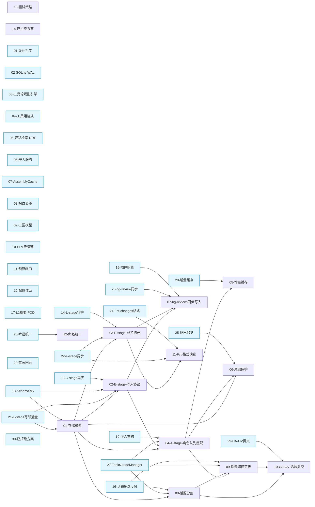

# CA 技术方案 Wiki

> 双维度文档体系：`architecture/`（空间/组件维度）+ `decisions/`（时间/决策维度）

## 关系图

## 索引

### architecture（14 页 — 空间维度：当前系统组件）

| # | 文件 | 版本引入 | 决策关联 |
|---|------|----------|----------|
| 01 | [存储模型](architecture/01-storage-model.md) | v5.0 | e-stage-write-on-receive, schema-v5-rewrite |
| 02 | [E-stage 写入协议](architecture/02-e-stage-write-protocol.md) | v5.0 | e-stage-write-on-receive, schema-v5-rewrite |
| 03 | [F-stage 异步摘要](architecture/03-f-stage-async-summary.md) | v5.2 | l-stage-daemon, fct-changes-format |
| 04 | [A-stage 角色队列匹配](architecture/04-a-stage-role-match.md) | v5.5 | topic-grade-manager, tail-protection, bg-review-sync, incremental-cache |
| 05 | [增量缓存](architecture/05-incremental-cache.md) | v5.8 | incremental-cache, topic-grade-manager |
| 06 | [尾巴保护](architecture/06-tail-protection.md) | v5.3 | tail-protection |
| 07 | [bg_review 同步写入](architecture/07-bg-review-sync-write.md) | v5.5 | bg-review-sync, plugin-responsibility |
| 08 | [话题分割](architecture/08-topic-segmentation.md) | v5.5 | topic-grade-manager, topic-picking-v46 |
| 09 | [话题切换定级](architecture/09-topic-grade-switch.md) | v5.5 | topic-grade-manager, tail-protection |
| 10 | [CA-OV 话题提交](architecture/10-ca-ov-topic-submit.md) | v5.5 | ca-ov-topic-submit, topic-grade-manager |
| 11 | [Fct 格式演变](architecture/11-fct-format-evolution.md) | v5.2 | fct-changes-format |
| 12 | [命名统一](architecture/12-naming-convention.md) | v5.5 | stage-terminology-unification |
| 13 | [测试策略](architecture/13-test-strategy.md) | v5.0 | — |
| 14 | [已拒绝方案](architecture/14-rejected-approaches.md) | v5.0 | rejected-approaches |

### decisions（30 页 — 时间维度：决策树）

| # | 文件 | 版本 | 类型 | 影响组件 |
|---|------|------|------|----------|
| 01 | [设计哲学](decisions/01-design-philosophy.md) | v0.x | 基线 | 全系统 |
| 02 | [SQLite + WAL](decisions/02-sqlite-wal-storage.md) | v0.x | 存储 | storage-model |
| 03 | [工具轮规则引擎](decisions/03-tool-summarizer-rules.md) | v1.0 | 工具 | — |
| 04 | [工具组格式](decisions/04-tool-group-format.md) | v1.2 | 工具 | — |
| 05 | [双路检索 + RRF](decisions/05-dual-retrieval-rrf.md) | v2.0 | 检索 | — |
| 06 | [嵌入服务](decisions/06-embedding-multi-backend.md) | v2.0 | 检索 | — |
| 07 | [AssemblyCache](decisions/07-assembly-cache-singleton.md) | v2.0 | 缓存 | — |
| 08 | [指纹去重](decisions/08-fingerprint-dedup.md) | v3.0 | 存储 | — |
| 09 | [三区模型](decisions/09-three-zone-model.md) | v2.0 | 装配 | a-stage-role-match |
| 10 | [LLM 降级链](decisions/10-llm-fallback-chain.md) | v2.0 | 降级 | — |
| 11 | [预算闸门](decisions/11-budget-gate.md) | v2.5 | 配置 | — |
| 12 | [配置体系](decisions/12-config-system.md) | v3.0 | 配置 | tail-protection |
| 13 | [C-stage 异步](decisions/13-c-stage-async.md) | v4.0 | 写入 | e-stage-write-protocol |
| 14 | [L-stage 守护](decisions/14-l-stage-daemon.md) | v4.0 | 摘要 | f-stage-async-summary |
| 15 | [插件职责](decisions/15-plugin-responsibility.md) | v4.0 | 架构 | bg-review-sync-write |
| 16 | [话题拣选 v4.6](decisions/16-topic-picking-v46.md) | v4.6 | 话题 | topic-segmentation, topic-grade-switch |
| 17 | [L1 摘要 PDD](decisions/17-l1-summary-pdd.md) | v4.7 | 摘要 | fct-format-evolution |
| 18 | [Schema v5](decisions/18-schema-v5-rewrite.md) | v5.0 | 存储 | storage-model, e-stage-write-protocol |
| 19 | [注入重构](decisions/19-injection-refactor.md) | v5.1 | 装配 | a-stage-role-match |
| 20 | [事故回顾](decisions/20-incidents-review.md) | v4.3~5.0 | meta | — |
| 21 | **E-stage 写即落盘** | v5.0 | 写入 | storage-model, e-stage-write-protocol |
| 22 | **F-stage 异步摘要** | v5.2 | 摘要 | f-stage-async-summary, fct-format-evolution |
| 23 | **术语统一** | v5.5 | meta | naming-convention |
| 24 | **Fct changes 格式** | v5.2 | 格式 | fct-format-evolution |
| 25 | **尾巴保护** | v5.3 | 装配 | tail-protection |
| 26 | **bg_review 同步** | v5.5 | 装配 | bg-review-sync-write |
| 27 | **TopicGradeManager** | v5.5 | 话题 | topic-segmentation, topic-grade-switch, a-stage-role-match |
| 28 | **增量缓存** | v5.8 | 缓存 | incremental-cache |
| 29 | **CA-OV 提交** | v5.5 | 持久化 | ca-ov-topic-submit |
| 30 | **已拒绝方案** | v5.0~5.8 | meta | rejected-approaches |

**粗体** = v5.x 新决策（旧决策树中无对应节点）

### 历史文档

旧设计文档（`docs/design/`）和决策树（OpenViking `projects/context-assembler/design/decision-points/`）已被本 wiki 取代。保留供历史参考。
