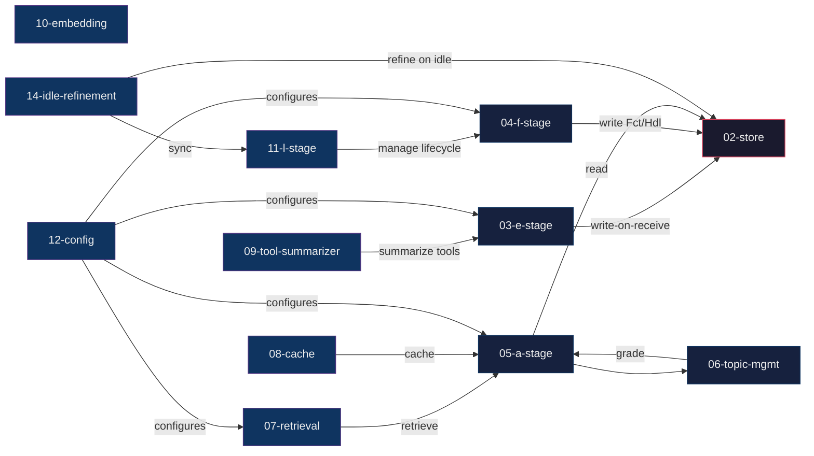

# CA 技术方案 Wiki

> 双维度文档体系：`architecture/`（空间/当前组件）+ `decisions/`（时间/决策演进）
> **适用版本：v6.0** | 源项目：`~/projects/context-assembler/`

## 关系图

> **注：tail-protection 内嵌于 05-a-stage，OV 话题提交内嵌于 06-topic-management，plugin-arch（Hook 注册 + CE shell）内嵌于 `plugins/ca_assembler/__init__.py`，无独立架构页。**

## 架构组件（architecture/）

| # | 文件 | 版本引入 | 源文件 | 说明 |
|---|------|----------|--------|------|
| 01 | [概览](architecture/01-overview.md) | v6.0 | — | 系统架构、模块依赖、术语 |
| 02 | [存储模型](architecture/02-store.md) | v5.10 | `ca/store.py` | turn_stream 表结构、WAL |
| 03 | [E-stage 写入](architecture/03-e-stage.md) | v5.0 | `ca/e_stage.py` | 5 Hook 写即落盘协议 |
| 04 | [F-stage 摘要](architecture/04-f-stage.md) | v5.2 | `ca/f_stage.py` | 异步 LLM 摘要（fin 粒度） |
| 05 | [A-stage 装配](architecture/05-a-stage.md) | v6.0 | `ca/a_stage.py` | direction B：DB 重建 conv_history（含 tail-protection） |
| 06 | [话题管理](architecture/06-topic-management.md) | v5.5 | `topic_manager.py` | TopicGradeManager 检测+定级（含 OV 话题提交） |
| 07 | [检索](architecture/07-retrieval.md) | v4.0 | `ca/retrieval.py` | BM25+向量双路+RRF |
| 08 | [缓存](architecture/08-cache.md) | v4.0 | `ca/cache.py` | AssemblyCache 内存缓存 |
| 09 | [工具摘要](architecture/09-tool-summarizer.md) | v4.3 | `ca/tool_summarizer.py` | 工具调用摘要引擎 |
| 10 | [嵌入](architecture/10-embedding.md) | v4.0 | `ca/embedding.py` | Ollama / ST 多后端 |
| 11 | [L-stage 引擎生命周期](architecture/11-l-stage.md) | v4.4 | `ca/lstage.py` | 生命周期管理 + L4 空闲精炼管线（v5.14 新增） |
| 12 | [配置体系](architecture/12-config.md) | v5.0 | `ca/config.py` | 配置加载+优先级 |
| 13 | [测试策略](architecture/13-test-strategy.md) | v5.0 | `tests/` | 分层测试体系 |
| 14 | [空闲精炼管线](architecture/14-idle-refinement.md) | v5.14→v2 | `ca/refinement.py` | L4 精炼轮：归并审查（宁并不分）+内精炼+交叉验证（reality 化，决策 41） |

## 决策时间线（decisions/）

| # | 文件 | 版本 | 决策类型 | 影响组件 |
|---|------|------|----------|----------|
| 01 | [设计哲学](decisions/01-design-philosophy.md) | v0.x | 架构基础 | 全系统 |
| 02 | [三阶段架构](decisions/02-three-stage-arch.md) | v4.3 | 架构 | 管线 |
| 03 | [SQLite WAL](decisions/03-sqlite-wal.md) | v4.2 | 存储 | store |
| 04 | [E-stage 写即落盘](decisions/04-e-stage-on-receive.md) | v5.0 | 数据协议 | e-stage |
| 05 | [F-stage 异步摘要](decisions/05-f-stage-async.md) | v5.2 | 管线 | f-stage |
| 06 | [方向 B](decisions/06-direction-b.md) | v6.0 | 架构重写 | a-stage, topic mgmt |
| 07 | [话题定级管理器](decisions/07-topic-grade-manager.md) | v5.5 | 话题 | topic_manager |
| 08 | [双路检索 RRF](decisions/08-dual-retrieval.md) | v4.0 | 检索 | retrieval |
| 09 | [AssemblyCache](decisions/09-assembly-cache.md) | v4.0 | 缓存 | cache |
| 10 | [工具摘要规则](decisions/10-tool-summarizer.md) | v4.3 | 工具 | tool_summarizer |
| 11 | [嵌入多后端](decisions/11-embedding-multi-backend.md) | v4.0 | 嵌入 | embedding |
| 12 | [LLM 降级链](decisions/12-llm-fallback.md) | v4.3 | LLM | f-stage |
| 13 | [尾巴保护](decisions/13-tail-protection.md) | v5.3 | A-stage | a-stage |
| 14 | [bg_review 同步](decisions/14-bg-review-sync.md) | v5.5 | 审计 | hooks |
| 15 | [指纹去重](decisions/15-fingerprint-dedup.md) | v4.1 | 数据 | store |
| 16 | [预算闸门](decisions/16-budget-gate.md) | v4.2 | A-stage | a-stage (legacy) |
| 17 | [L-stage 守护线程](decisions/17-l-stage-daemon.md) | v4.4→v5.10 | 守护→取代 | l-stage（v5.10 被 F-stage 取代） |
| 18 | [术语统一](decisions/18-naming-unification.md) | v5.5 | 命名 | 全系统 |
| 19 | [Schema v5](decisions/19-schema-v5.md) | v5.0 | 存储 | store |
| 20 | [CE 壳注册](decisions/20-ce-shell-registration.md) | v5.10 | 插件 | plugin |
| 21 | [引擎 TTL 恢复](decisions/21-engine-ttl-recovery.md) | v6+ | 稳定性 | plugin |
| 22 | [State DB 去重](decisions/22-state-db-dedup.md) | v6.1 | 修复 | plugin |
| **23** | **[已拒绝方案](decisions/23-rejected-approaches.md)** | v0-v6 | 汇总 | — |
| **28** | **[话题摘要 v4](decisions/28-topic-summarization-v4.md)** | v6.0 | 摘要 | f-stage, topic_summarizer |
| **34** | **[空闲精炼管线](decisions/34-idle-refinement.md)** | **v5.14→v2** | **自我维护** | **l-stage, realities, store（reality 化，2026-08-07）** |
| **35** | **[Strand 多事务摘要](decisions/35-strand-multi-affair-summarization.md)** | v6.4 | 摘要 | strand_summaries, topic_summary |
| **36** | **[Wiki Theme 生成重构](decisions/36-theme-wiki-generation.md)** | v6.5 | 归并 | theme, store |
| **37** | **[Reality 重构](decisions/37-reality-restructure.md)** | v6.6+ | 检索/归并 | reality, theme |
| **38** | **[图模型+注入/归并闭环](decisions/38-reality-graph-inject-merge.md)** | v7 | 检索 | cooccurrence, theme, inject |
| 38a | [注入侧 4B 拣选 prompt](decisions/38-inject-prompt.md) | v7 | 检索 | inject |
| **39** | **[Reality 成员云表征](decisions/39-reality-member-clouds.md)** | v7 | 检索 | inject, theme |
| **40** | **[Flash 全链路重跑 Pilot](decisions/40-flash-reprocess-pilot.md)** | v7 | 任务书 | reprocess |
| **41** | **[生产 reality 化迁移 + graphify 增量旁路改造](decisions/41-reality-production-migration.md)** | v7 | 迁移/检索 | realities, inject, graphify, refinement |
| **42** | **[Hindsight 借鉴：检索图路/时序路 + 心智模型层](decisions/42-hindsight-borrowed-retrieval.md)** | v7 | 检索增强 | retrieval, graphify, refinement |

## 相关资源

| 资源 | 位置 | 说明 |
|------|------|------|
| **OV 决策树（全量）** | OV `projects/context-assembler/design/decision-points/` | 141+ 独立决策节点（完整追溯） |
| **OV 变更日志** | OV `projects/context-assembler/changelog.md` + `changelog-v6-continuation.md` | v0.1 ~ v6.1 完整版本历史 |
| **代码** | `tester/plugins/ca_assembler/` | 插件核心代码 |
| **测试** | `tester/plugins/ca_assembler/tests/` | pytest 测试套件 |
| **OpenViking** | `viking://resources/projects/context-assembler/` | OV 知识库中的 CA 条目 |
